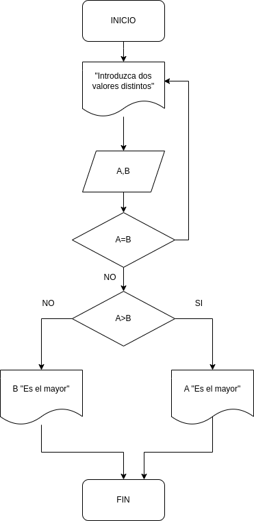
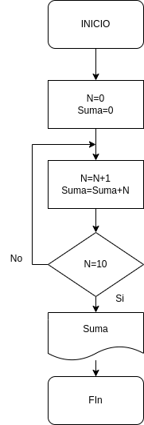

<dir align ="justify">

# Ejercicios

## INDICE

- [Ejercicio 1](#ejercicio1)
- [Ejercicio 2](#ejercicio2)
- [Ejercicio 3](#ejercicio3)

## Ejercicio 1

Desarrolle un algoritmo que permita leer dos valores distintos, determinar cual de los dos valores es el mayor y escribirlo.

---

### Pseudocódigo

Pasos:

- Inicio 
-  Inicializar variables: __A=0,B=0__
-  Solicitar la introducción de los valores distintos.
-  Leer los dos valores.
-  Asignarlos a las variables __A y B__
-  Si __A=B__ Entonces vuelve a 3 porque los valores deben ser distintos
-  Si __A>B__ Entonces
   Escribir __A "es el mayor"__
-  De lo contrario: Escribir __B, "Es el mayor"__
-  Fin_si
-  Fin.

</dir>

### Diagrama de Flujo
  ---

  

## Ejercicio 2

Desarrolle un algoritmo que permita leer tres valores y almacenarlos en las variables __A, B y C__
respectivamente. El algoritmo debe imprimir cual es el mayor y cual es el menor. Recuerde constatar que
los tres valores introducidos por el teclado sean valores distintos. Presente un mensaje de alerta en caso de
que se detecte la introducción de valores iguales.

---

### Pseudocódigo

Pasos:

- Inicio
- Inicializar las variables __A, B y C__
- Leer los tres valores
- Almacenar en las variables __A, B y C__
- Si __A > B__ y __A > C__ Entonces
- Escribir __A “Es el mayor”__
- Sino
- Si __B > A__ y __B > C__ Entonces
- Escribir __B “Es el mayor”__
- Sino
- Escribir __C “Es el mayor”__
- Fin_Si
- Fin_Si
- Fin

</dir>

### Diagrama de Flujo 2
  ---

  

# Ejercicio 3

Desarrolle un algoritmo que realice la sumatoria de los números enteros comprendidos entre el 1 y el 10,
es decir, 1 + 2 + 3 + .... + 10.

---

### Pseudocódigo

Pasos:

- Inicio
- Declaración de variables:
- Asignación Contador :
- Asignación Acumulador:
- Si N = 10 Entonces
- Escribir Suma
- De lo contrario, Repetir desde el
- Fin_Si
- Fin

</dir>

### Diagrama de Flujo 2
  ---

  

  
  
