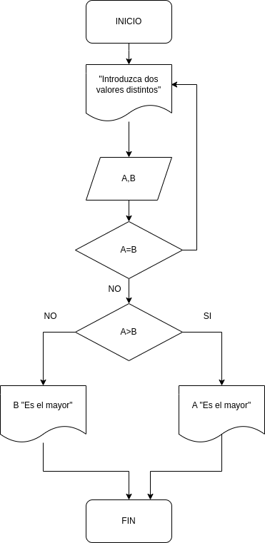

<dir align ="justify">

# Ejercicios

## INDICE

- [Ejercicio 1](#ejercicio1)

## Ejercicio 1

Desarrolle un algoritmo que permita leer dos valores distintos, determinar cual de los dos valores es el mayor y escribirlo.

---

### Pseudocódigo

Pasos:

- Inicio
-  Inicializar variables: __A=0,B=0__
-  Solicitar la introducción de los valores distintos.
-  Leer los dos valores.
-  Asignarlos a las variables __A y B__
-  Si __A=B__ Entonces vuelve a 3 porque los valores deben ser distintos
-  Si __A>B__ Entonces
   Escribir __A "es el mayor"__
-  De lo contrario: Escribir __B, "Es el mayor"__
-  Fin_si
-  Fin.

</dir>

### Diagrama de Flujo
---

  