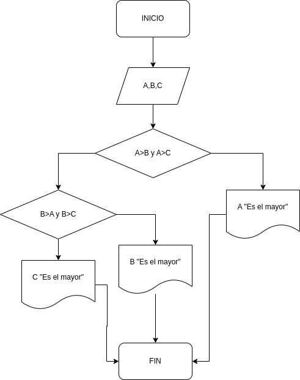

# Ejercicio 2

<!-- Recuerda que

## 1. Subtítulo tarea

### 1.1 Subtítulo de la tarea

-- Incluir imagenes

     

-->

## Descripción del ejercicio

Desarrolle un algoritmo que permita leer tres valores y almacenarlos en las variables A, B y C respectivamente. El algoritmo debe imprimir cual es el mayor y cual es el menor. Recuerde constatar que los tres valores introducidos por el teclado sean valores distintos. Presente un mensaje de alerta en caso de que se detecte la introducción de valores iguales.

## Diagrama de flujos

     

## Pseudocódigo

- Inicio
- Inicializar las variables __A, B y C__
- Leer los tres valores
- Almacenar en las variables __A, B__
y C
- Si __A > B y A > C__ Entonces
- Escribir __A “Es el mayor”__
- Sino
- Si __B > A y B > C__ Entonces
- Escribir __B “Es el mayor”__
- Sino
- Escribir __C “Es el mayor”__
- Fin_Si
- Fin_Si
- Fin

## Referencias

