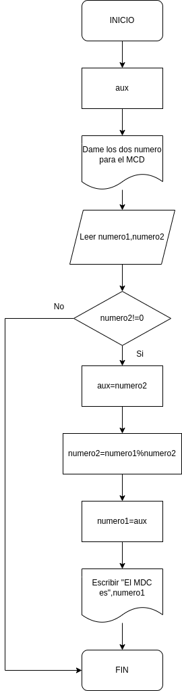
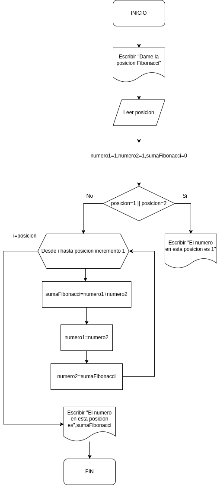
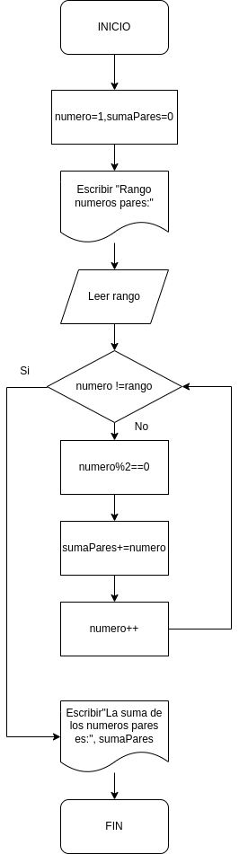

# TAREA 4-PROGRAMACION(BUCLES Y IF)

## INDICE

- [Ejercicio 1](#ejercicio1)
- [Ejercicio 2](#ejercicio2)
- [Ejercicio 3](#ejercicio3)
- [Ejercicio 4](#ejercicio4)
- [Ejercicio 5](#ejercicio5)
- [Ejercicio 6](#ejercicio6)
- [Ejercicio 7](#ejercicio7)
- [Ejercicio 8](#ejercicio8)
- [Ejercicio 9](#ejercicio9)
- [Ejercicio 10](#ejercicio10)

# Ejercicio 1 

Escribe un programa en Java que imprima el patrón siguiente:

1

2 3

4 5 6

7 8 9 10

### Diagrama de Flujo

### Pseudocódigo

Pasos:
- Inicio
- Inicializar variables: numero=1
- Desde i=1 hasta 4 incrementar 1
- Escribir "" 
- Desde j=1 hasta i incrementar 1
- Escribir numero
- numero++
- Fin

# Ejercicio 2 

Escribe un programa en Java que encuentre el máximo común divisor (MCD) de dos números.

### Diagrama de Flujo

### Pseudocódigo

Pasos:

- Inicio
- Inicializar variables: aux
- Solicitar la introducción de los dos numeros para el MCD
- Leer los dos valores: numero1 y numero2
- Mientras numero 2 sea diferente a 0 hacer
- aux=numero2
- numero2=numero1%numero2
- numero1=aux
- Fin_Mientras
- Escribir "El MCD de estos dos numero es:" +numero1
- Fin

# Ejercicio 3 

Escribe un programa en Java que encuentre el número de Fibonacci en la posición n.
Se debe solicitar el número por teclado.

### Diagrama de Flujo

### Pseudocódigo

Pasos:
- Inicio
- Solicitar la introducción de la posición
- Leer posicion
- Decaracion variables:numero1=1;numero2=1,sumaFibonacci=0
- Si posicion=1 o posicion=2 entonces 
- Escribir "El numero en esta posicion es 1"
- FinSi
- Desde i hasta posicion hacer incremento en 1 
- sumaFibonacci=numero1 + numero2
- numero1=numero2
- numero2=sumaFibonacci
- Escribir "El numero en esta posicion es", sumaFibonacci
- Fin

# Ejercicio 4 

Escribe un programa en Java que verifique si un número es palíndromo. Se debe solicitar el número por teclado.

### Diagrama de Flujo

### Pseudocódigo

# Ejercicio 5 

Escribe un programa en Java que imprima los primeros n términos de la secuencia de Fibonacci.
Se debe solicitar el número n por teclado.

### Diagrama de Flujo

### Pseudocódigo

Pasos:
- Inicio
- Solicitar la introducción de la posición
- Leer posicion
- Declaracion variables=numero1=1,numero2=1
- Escribir "numero1 + "," + numero2"
- Desde i=2 hasta posicion hacer incremento en 1
- sumaFibonacci=numero1 + numero2
- Escribir " "," + sumaFibonacci"
- numero1=numero2
- numero2=sumaFibonacci
- Escribir "El numero en esta posicion es", sumaFibonacci
- Fin

# Ejercicio 6 

Describe un programa en Java que encuentre todos los números Armstrong entre 1 y 1000.

### Diagrama de Flujo

### Pseudocódigo

Pasos:
- Inicio
- Inicializar variables: __A = 0, B = 0__
- Solicitar la introducción de dos valores distintos
- Leer los dos valores
- Asignarlos a las variables A y B
- Si ___A = B___ Entonces vuelve a 3 porque los valores deben ser distintos
- Si ___A > B___ Entonces
  Escribir A, __“Es el mayor”__
- De lo contrario: Escribir __B, “Es el mayor”__
- Fin_Si
- Fin

# Ejercicio 7 

Imprimir el nombre del día de la semana correspondiente a un número ingresado por el usuario utilizando una estructura switch.

### Diagrama de Flujo

### Pseudocódigo

Pasos:
- Inicio
- Solicitar la introducción del día de la semana
- Leer opcion
- Segun opcion hacer
- Caso, valor expresión 1
- Escribir "Lunes"
- Caso, valor expresión 2
- Escribir "Martes"
- Caso, valor expresión 3
- Escribir "Miércoles"
- Caso, valor expresión 4
- Escribir "Jueves"
- Caso, valor expresión 5
- Escribir "Viernes"
- Caso, valor expresión 6
- Escribir "Sábado"
- Caso, valor expresión 7
- Escribir "Domingo"
- Caso, Sino
- Escribir "Lo siento, ese numero es erroneo"
-FinSegun
- Fin

# Ejercicio 8 

Encontrar y mostrar todos los números perfectos en un rango dado utilizando un bucle for. Solicita el límite por teclado.

### Diagrama de Flujo

### Pseudocódigo

- Inicio
- Inicializar variables: rango,suma
- Solicitar la introducción del rango
- Leer el rango
- Desde i hasta rango hacer Incremento 1
- Suma=0
- Desde j hasta i hacer incremento 1
- Si el resto de i entre j es 0 entonces
- suma=suma+j
- FinSi
- Si suma es igual a i entonces
- "El numero",i,"es perfecto"
- FinSi
- Fin

# Ejercicio 9 

Imprimir la tabla de multiplicar de un número ingresado por el usuario utilizando un bucle for.

### Diagrama de Flujo

### Pseudocódigo

Pasos:
- Inicio
- Solicitar la introducción del numero de la tabla
- Leer tabla
- Declaracion de variables: multiplicacion
- Desde i=1 hasta 10 hacer incremento en 1
- multiplicacion=tabla*i
- Escribir "tabla + "x" + i + "=" + multiplicacion"
- Fin

# Ejercicio 10 

Calcular la suma de todos los números pares entre 1 y un número ingresado por el usuario utilizando un bucle do-while.
### Diagrama de Flujo

### Pseudocódigo

Pasos:
- Inicio
- Solicitar la introducción del rango
- Leer rango
- Declaracion de variables: numero=1;sumaPares=0
- Hacer mientras numero != rango
- Si el resto del numero es 0
- sumaPares=sumaPares+numero
- Incremento del numero
FinSi
FinMientras
- Escribir "La sumas de los numeros pares hasta ese rango es:" + sumaPares
- Fin

