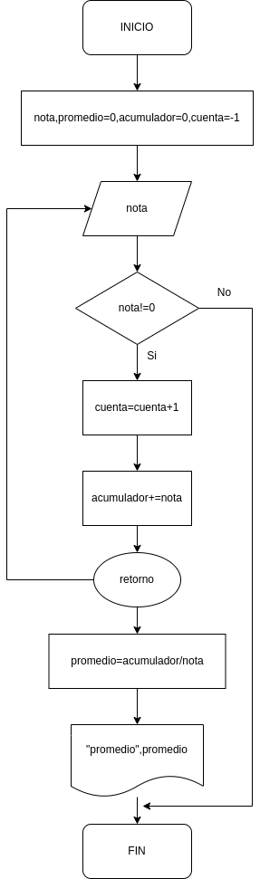

# Ejercicio 8 - Promedio de Notas

## Descripción del ejercicio

Se desarrolla un algoritmo que permita calcular Promedio de Notas; finaliza cuando N = 0.

## Diagrama de flujos

     

## Pseudocódigo

- Inicio
- Declaración de Variables: __nota,promedio=0,acumulador=0, y cuenta=-1__
- Leer nota
- Mientras __nota!=0__ hacer 
- cuenta = __cuenta + 1__
- acumulador = __acumulador + nota__ 
- Fin Mientras 
- Promedio = __acumulador/cuenta__ 
- Imprimir “Promedio:”; __Promedio__
- Fin

