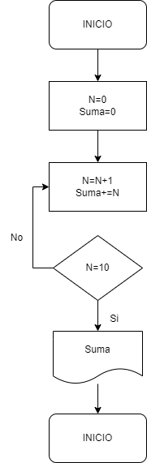

# Ejercicio 3

## Descripción del ejercicio

Desarrolle un algoritmo que realice la sumatoria de los números enteros comprendidos entre el 1 y el 10, es decir, 1 + 2 + 3 + …. + 10. Utilia un buble __for__ y un bucle __while__.

## Diagrama de flujos

     

## Pseudocódigo

- Inicio  
- Declaración de variables: __N= 0, Suma = 0__ 
- Asignación Contador : __N = N + 1__ 
- Asignación Acumulador: __Suma = Suma + N__ 
- Si __N = 10__ Entonces 
- Escribir __Suma__ 
- De lo contrario, __Repetir desde el paso 3__ 
- Fin_Si
- Fin

## Referencias

