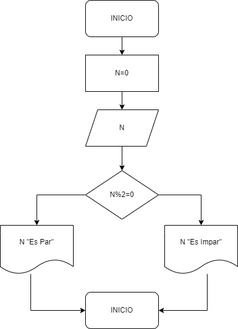

# Ejercicio 3

## Descripción del ejercicio

Desarrolle un algoritmo que permita leer un valor cualquiera N y escriba si dicho número es par o impar.

## Diagrama de flujos

     

## Pseudocódigo

- Inicio
- Declaración de variables: __N__ 
- Leer un número 
- Asignarlo a la variable __N__ 
- Si el __residuo__ de dividir a __N entre 2 es igual a cero__ 
- Si es Si: Entonces: __Escribir “ Es par”__ 
- Sino: __Escribir “Es impar”__ 
- Fin_Si 
- Fin

## Referencias

